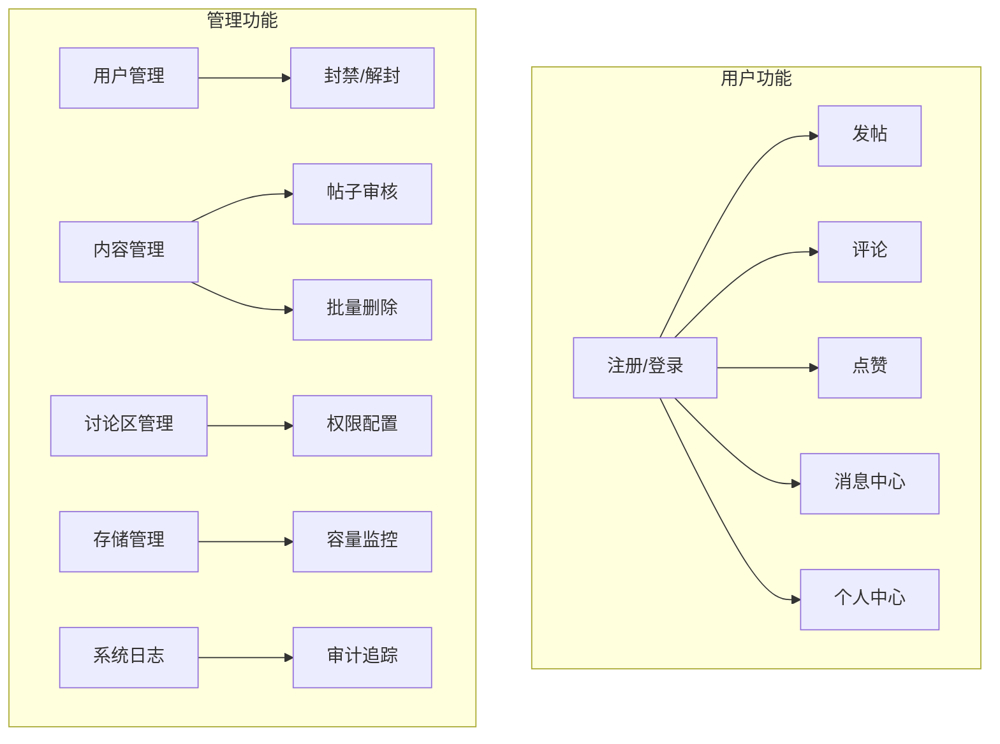
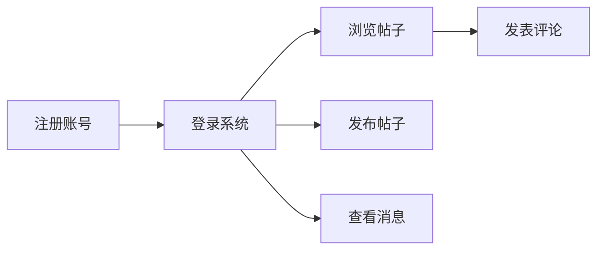
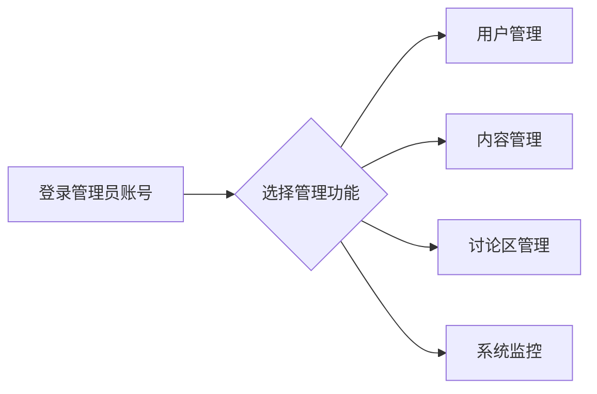

# 使用说明

## 项目简介

**AI传感器编程学习论坛** 是一个功能完整的社区论坛系统，支持用户注册登录、发帖评论、附件上传、消息通知等功能，并提供完善的管理后台。

---

## 功能概览

---

## 角色与权限

系统采用 RBAC（基于角色的访问控制）权限体系，共有 4 种角色：

| 角色 | 权限等级 | 主要职能 |
| :--- | :---: | :--- |
| **user** | ⭐ | 基础用户，可浏览、发帖、评论、点赞 |
| **admin** | ⭐⭐ | 普通管理员，可管理用户（封禁/解封） |
| **superadmin** | ⭐⭐⭐ | 超级管理员，可管理讨论区、审批昵称、批量操作 |
| **topadmin** | ⭐⭐⭐⭐ | 最高管理员，拥有系统完全控制权 |

> [!NOTE]
> 详细的角色操作手册请参阅 `manuals/` 目录下对应的文档文件。

---

## 用户功能

### 1. 账号管理

#### 注册
1. 访问首页，点击右上角「注册」按钮
2. 填写邮箱、密码和昵称
3. 提交后自动登录

#### 登录
1. 点击「登录」按钮
2. 输入注册邮箱和密码
3. 支持「忘记密码」功能，通过邮箱验证码重置

#### 个人中心 (`/me`)
- 查看/修改个人资料
- 修改昵称（首次可直接修改，二次修改需申请审批）
- 修改密码（需邮箱验证码确认）
- 查看我的帖子和评论

### 2. 论坛互动

#### 浏览帖子 (`/posts`)
- 支持按讨论区筛选
- 分页浏览帖子列表
- 置顶帖子优先显示

#### 发布帖子 (`/posts/new`)
1. 选择目标讨论区
2. 填写标题和内容
3. 可选择上传附件或图片
4. 勾选确认复选框后提交

#### 评论与互动
- 在帖子详情页发表评论
- 评论显示楼层号
- 对他人帖子点赞（不能给自己点赞）

### 3. 消息中心 (`/messages`)
- 实时显示未读消息数量（导航栏红点提示）
- 查看系统通知和管理员消息
- 支持批量选择和删除消息
- 管理员消息中的链接可直接点击跳转

---

## 管理功能

> [!IMPORTANT]
> 以下管理功能仅对 admin 及以上角色可见。

### 1. 用户管理 (`/admin/users`)

| 操作 | admin | superadmin | topadmin |
| :--- | :---: | :---: | :---: |
| 查看用户列表 | ✅ | ✅ | ✅ |
| 封禁/解封用户 | ✅ | ✅ | ✅ |
| 修改用户角色 | ❌ | ❌ | ✅ |
| 重置用户密码 | ❌ | ✅ | ✅ |

### 2. 昵称审批 (`/admin/nickname-requests`)
- 查看待审核的改名申请
- 批准或拒绝申请
- 仅 superadmin/topadmin 可访问

### 3. 讨论区管理 (`/admin/discussion-areas`)
- 创建、编辑、删除讨论区
- 调整讨论区排序
- 配置各角色的访问权限（查看/发帖/评论/下载）
- 仅 superadmin/topadmin 可访问

### 4. 批量删除 (`/admin/posts/bulk-delete`)
- 批量删除指定用户的帖子
- 清理已封禁用户的内容
- 仅 superadmin/topadmin 可访问

### 5. 存储管理 (`/admin/storage`)
- 查看当前存储使用情况
- 调整存储上限（1GB - 100GB）
- 监控 90% 使用率预警
- 仅 superadmin/topadmin 可访问

### 6. 系统日志 (`/admin/system-logs`)
- 查看完整的操作审计记录
- 支持多条件组合筛选（时间、类型、操作人等）
- 操作人输入支持联想搜索
- 仅 topadmin 可访问

---

## 页面导航

### 公共页面

| 路径 | 说明 |
| :--- | :--- |
| `/` | 首页 |
| `/posts` | 帖子列表 |
| `/posts/:id` | 帖子详情 |
| `/areas/:id` | 讨论区详情 |
| `/login` | 登录 |
| `/register` | 注册 |
| `/forgot-password` | 忘记密码 |
| `/reset-password` | 重置密码 |

### 用户页面

| 路径 | 说明 |
| :--- | :--- |
| `/me` | 个人中心 |
| `/me/password` | 修改密码 |
| `/me/posts` | 我的帖子 |
| `/me/comments` | 我的评论 |
| `/messages` | 消息中心 |
| `/posts/new` | 发布帖子 |
| `/posts/:id/edit` | 编辑帖子 |

### 管理页面

| 路径 | 权限 | 说明 |
| :--- | :--- | :--- |
| `/admin/users` | admin+ | 用户管理 |
| `/admin/nickname-requests` | superadmin+ | 昵称审批 |
| `/admin/discussion-areas` | superadmin+ | 讨论区管理 |
| `/admin/posts/bulk-delete` | superadmin+ | 批量删除 |
| `/admin/storage` | superadmin+ | 存储管理 |
| `/admin/system-logs` | topadmin | 系统日志 |

---

## 附件与图片

### 上传限制
- 单个附件大小：10B - 100MB
- 支持多部分上传（大文件自动分片）
- 存储使用 Cloudflare R2

### 支持的文件类型
帖子和评论均支持附件上传，系统会自动识别并展示图片预览。

---

## 安全特性

1. **密码安全**
   - 密码使用 SHA-256 + 随机盐加密存储
   - 修改密码需邮箱验证码二次确认

2. **会话管理**
   - 基于 Cookie 的会话认证
   - 支持临时密码和强制改密

3. **操作审计**
   - 所有敏感操作记录到 `security_audit_logs`
   - 包含时间戳、IP地址、User-Agent等信息

4. **权限控制**
   - 高危操作需二次密码验证
   - 角色变更触发系统警告

---

## 快速入门

### 普通用户

### 管理员

---

## 手册文档

更详细的分角色操作指南，请参阅以下文档：

| 文档 | 说明 |
| :--- | :--- |
| [user_manual.md](manuals/user_manual.md) | 普通用户使用手册 |
| [admin_manual.md](manuals/admin_manual.md) | 管理员操作手册 |
| [superadmin_manual.md](manuals/superadmin_manual.md) | 超级管理员操作手册 |
| [topadmin_manual.md](manuals/topadmin_manual.md) | 最高管理员操作手册 |

---

## 版本记录

| 版本 | 日期 | 说明 |
| :--- | :--- | :--- |
| v1.0 | 2025-12-28 | 首次发布 |

**最后更新**：2025-12-28
